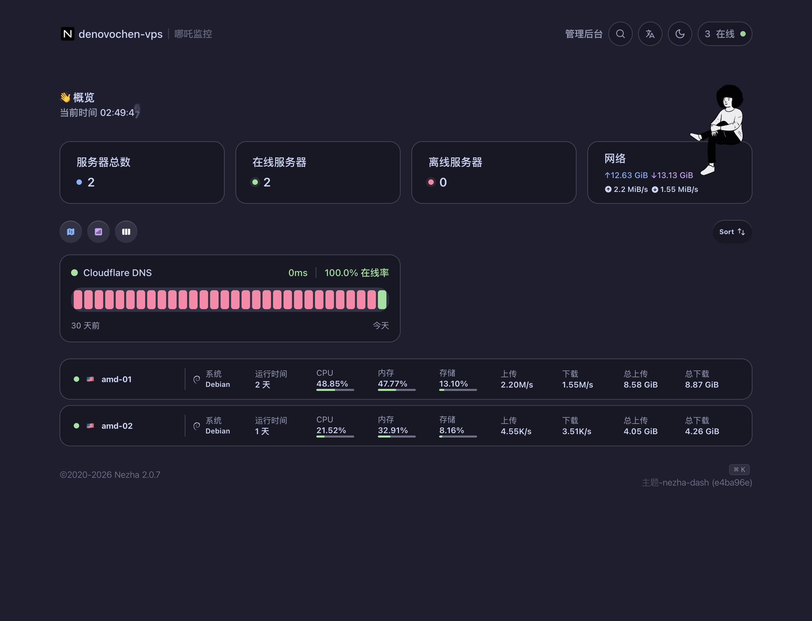
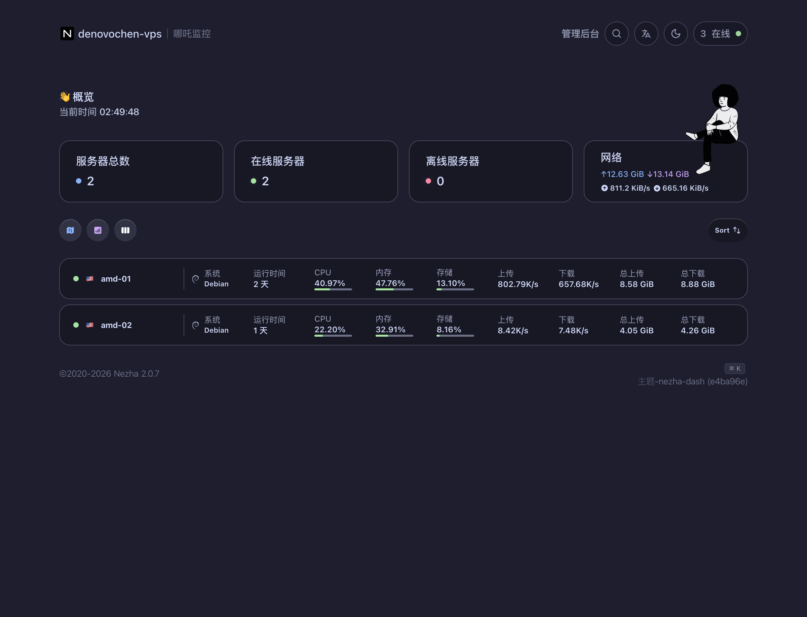
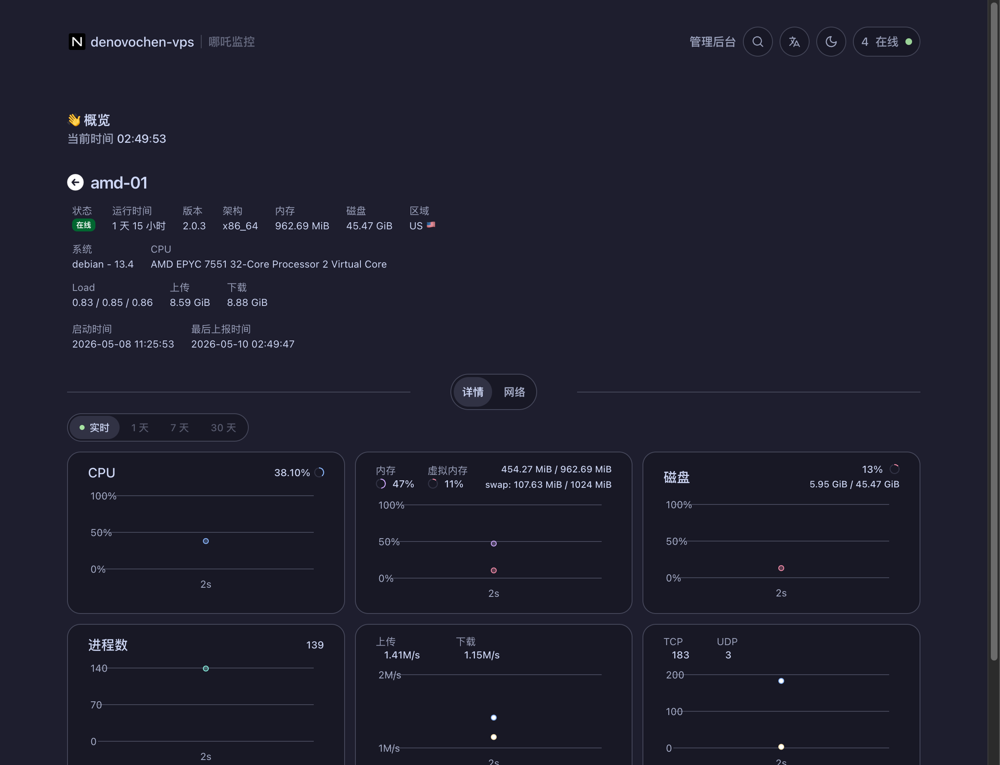

# Nezha Catppuccin Mocha Theme

**Language:** English | [简体中文](README.zh-CN.md)

A Catppuccin Mocha custom-code theme for the Nezha monitoring panel.

This theme targets Nezha v2 with the `nezha-dash` user frontend and the official admin dashboard. It uses the official Catppuccin Mocha palette and avoids decorative gradients, so the interface stays close to the original Mocha color system.

## Preview







## Install

Open Nezha admin dashboard:

```text
Dashboard -> Settings -> System Settings
```

Paste these files into the two custom-code fields:

| Nezha field | File |
| --- | --- |
| `自定义代码（样式和脚本）` | [`dist/user-custom-code.html`](dist/user-custom-code.html) |
| `仪表板的自定义代码` | [`dist/admin-custom-code.html`](dist/admin-custom-code.html) |

Then click `确认`.

## Palette

The theme follows the official Catppuccin Mocha palette:

| Token | Hex |
| --- | --- |
| Base | `#1e1e2e` |
| Mantle | `#181825` |
| Crust | `#11111b` |
| Surface0 | `#313244` |
| Surface1 | `#45475a` |
| Overlay1 | `#7f849c` |
| Subtext0 | `#a6adc8` |
| Text | `#cdd6f4` |
| Mauve | `#cba6f7` |
| Blue | `#89b4fa` |
| Green | `#a6e3a1` |
| Red | `#f38ba8` |

Reference: [Catppuccin palette](https://catppuccin.com/palette/).

## Coverage

The custom CSS covers:

- User homepage cards, buttons, server list, service monitor cards, map view, and server detail charts.
- Admin dashboard form controls, tabs, inputs, cards, buttons, and active states.
- Nezha theme classes that use Tailwind `stone`, `neutral`, `emerald`, `green`, and chart utility classes.

## Tested With

- Nezha `2.0.7`
- User frontend theme `nezha-dash` commit `e4ba96e`
- Admin frontend from the current Nezha v2 dashboard

## Notes

This repository only provides custom-code snippets. It does not modify Nezha source code.

This project is not affiliated with Catppuccin or Nezha.

## License

MIT License.
